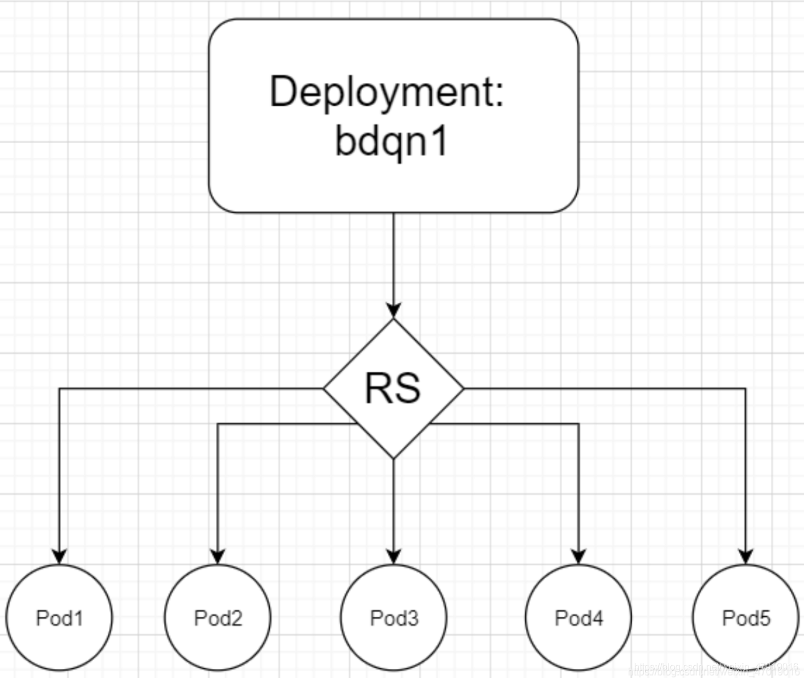

helm

helm包管理工具

helm list查看chart list


chart


release


# 实例

## deployment

```shell
kind: Deployment
apiVersion: extensions/v1beta1
metadata:
  name: test1
spec:
  replicas: 5
  template:
    metadata:
      labels:
        app: test1
    spec:
      containers:
      - name: test1
        image: httpd
        ports:
            - containerPort: 80
```





## service

```shell
kind: Service
apiVersion: v1
metadata:
  name: test-svc
spec:
  type: NodePort  # 为了能让外网访问，需要设置service的类型是nodetport
  selector:
    app: test1
  ports:
  - protocol: TCP
    port: 80
    targetPort: 80
    nodePort: 32034  #nodePort的有效范围是：30000-32767
```

