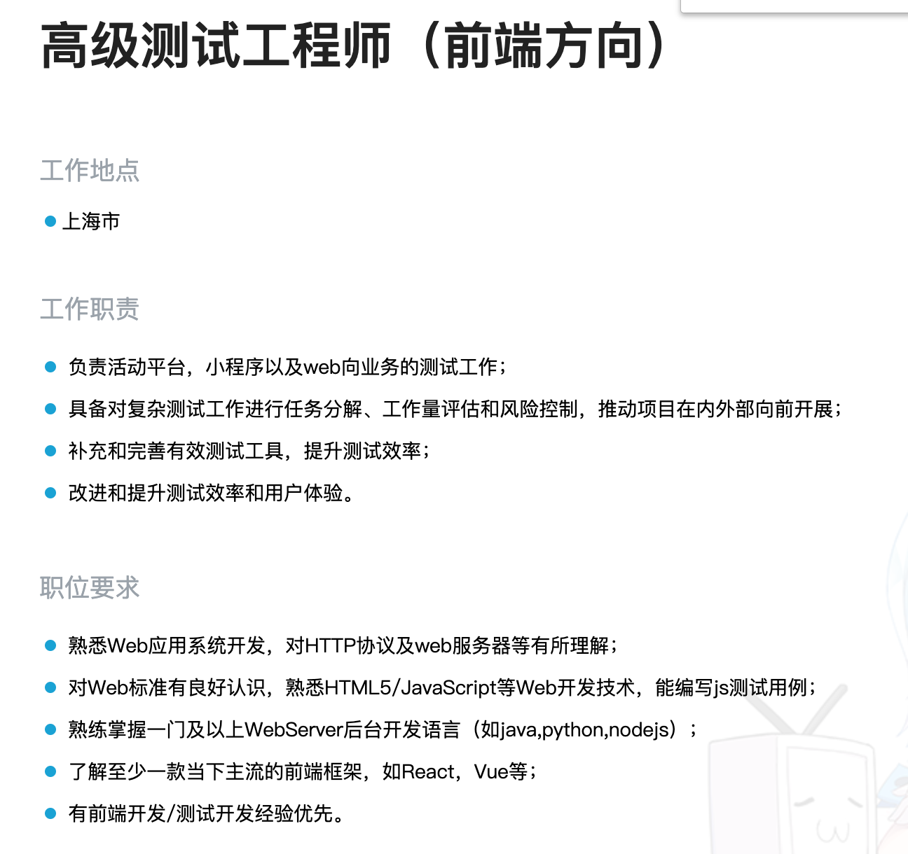
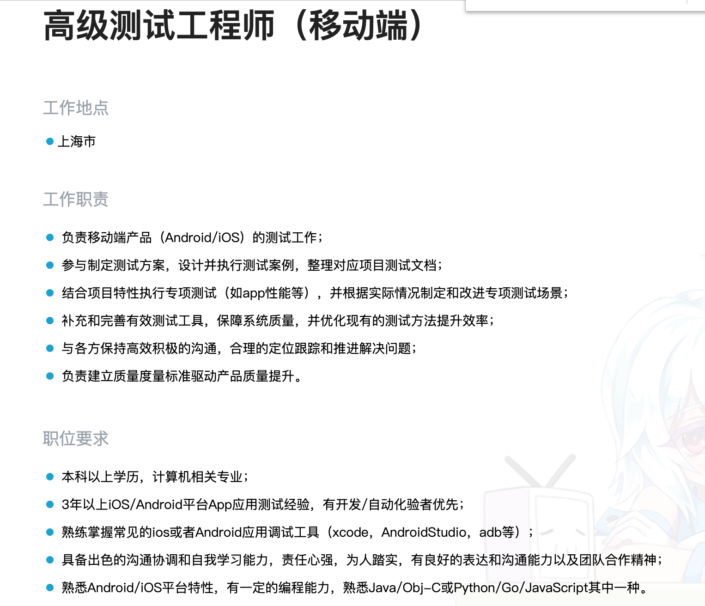
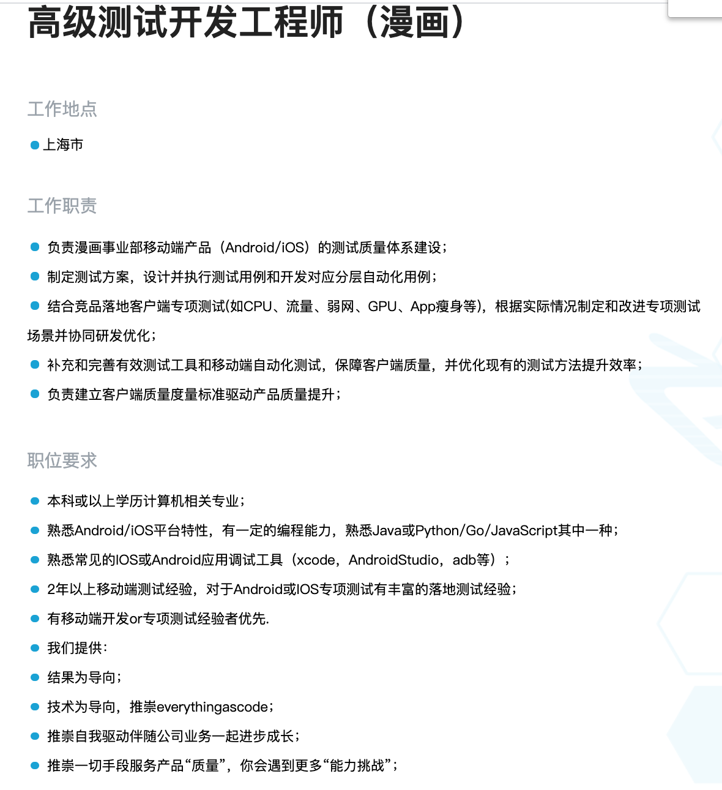
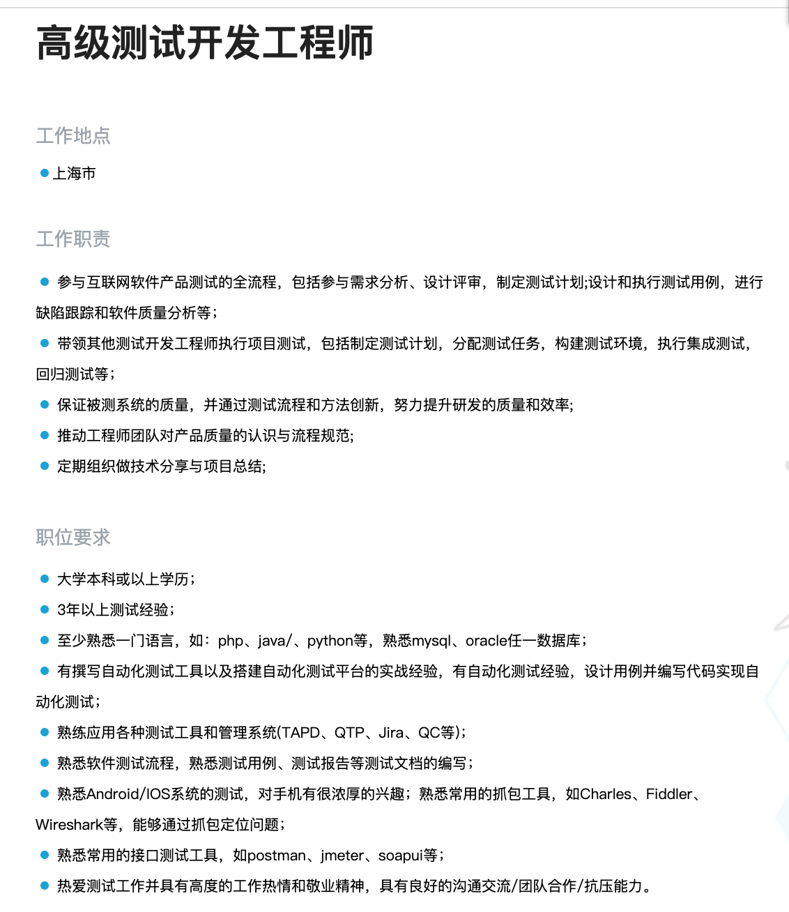

## 国内大厂的一些3-5年测试工程师的招聘要求，看一下自己还有哪些方面的不足：

负责漫画事业部移动端产品（Android/iOS）的测试质量体系建设；

 制定测试方案，设计并执行测试用例和开发对应分层自动化用例；

 结合竞品落地客户端专项测试(如CPU、流量、弱网、GPU、App瘦身等)，根据实际情况制定和改进专项测试场景并协同研发优化；

 补充和完善有效测试工具和移动端自动化测试，保障客户端质量，并优化现有的测试方法提升效率；

 负责建立客户端质量度量标准驱动产品质量提升

