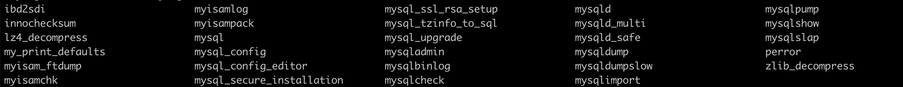

## SQL简介

sql：结构化查询语言

sql是一种【声明】语言

SQL语言是为计算机**声明**一个你想从原始数据中获取结果的一个范例，而不是告诉计算机如何能够得到结果，sql执行引擎会根据你的声明去获取对应的数据

SQL语法的执行顺序：

from——》where——〉group by——》having——〉select——》distinct——〉union——》order by

但是～不同的引擎其实执行顺序是有差别的

所以我们需要关注就是：SQL的执行顺序和我们书写的顺序是不一样的，尤其是：from是执行的第一句

所以，SQL语句的核心不是select，而是from

from——对表的引用才是SQL的核心（感觉和ORM是不是有点类似？表才是核心）

```sql
select * from a,b;
```

这句话会输出一个a*b的全连接的表

ok，这就是我们from之后的结果，再然后，sql执行引擎会更加where｜group by对这个联合表进行筛选

这里我们是不是由于from的全连接的表勾起了我们的另一个概念join？对的，实际中是不推荐【from a,b】这种连接的，推荐join连接，他俩一样，但是join更加易读

sql中的表连接根本上有5中：equi join、semi join、anti join、cross join、devision

equi join包含：inner join（也就是join）、outer join（包含left join、right join、full outer join）

semi join：in和exist的子查询

anti join：【semi join】的结果取反

cross join：a*b的结果

devision：join的逆过程（超纲了，不会）

总结：【sql是对表的引用，join则是一种引用表的复杂方式】

子查询、派生表、group by其实都是对表的引用，你品品，是不是都是构造了新的表的引用，这就好理解多了

## MySQL

bin目录下有很多的工具包：比如：mysqldump、musqlimport



### Mysql数据类型

数值型：int、float

字符串型：char、varchar、text

日期型：data、time

布尔：boolean

枚举：enum

char(10)、varchar(10)的区别：

​	char(10)：定长10个字符，不足的用空格补齐，最大支持256个字符

​	varchar(10)：非定长，输入多少存多少，最大支持的长度长

​	char(10)和varchar(10)都是超过10的话存不进去

### Mysql常用函数

数字函数：abs、max、min、sum、rand、sign

字符函数：

​	length(s)：获取字符串s的长度

​	concat(a,b,c)：拼接字符串a、b、c

​	locate('e','hello')：返回2，在字符串中开始的位置

​	trim(s)：去字符串两边的空格

​	substr(s,start,length)：截取s从start位置开始，length长度的字符串

日期函数：

​	curdate()、curtime()、current_timestamp()、adddate(d,n)、addtime(t,n)、day(n)、 datediff(d1,d2)

​	dayname(d)、dayofmonth(d)、dayofweek(d)、dayofyear(d) 

​	unix_timestamp()、from_unixtime()

高级函数：

```
CASE 表示函数开始，END 表示函数结束。如果 condition1 成立，则返回 result1, 如果 condition2 成立，则返回 result2，当全部不成立则返回 result，而当有一个成立之后，后面的就不执行了。
SELECT CASE 
　　WHEN 1 > 0
　　THEN '1 > 0'
　　WHEN 2 > 0
　　THEN '2 > 0'
　　ELSE '3 > 0'
　　END
->1 > 0
```

```
如果表达式 expr 成立，返回结果 v1；否则，返回结果 v2。
SELECT IF(1 > 0,'正确','错误')    
->正确
```

### Mysql运算符、语句

比较运算符：

```bash
>、<、=、>=、<=、!=、&lt;、 &gt;、
```

成员运算符：in、not in（这俩后面跟集合）

逻辑运算符：and、or、not

模糊查询：like（%任意字符，_单一字符）

去重：distinct（这个少用，因为去重需要数据库重复从硬盘读取数据到内存中）

统计函数：sum、avg、max、min、count（常放在select之后，也可以放在having之后，意会一下其实也是某种含义上的分组）

​	ps：count(*) = count(1) 值为null的不会被count进去

分组：group by

​	分组就是把一类具有相同特性的放在一起，组成一个新的类

​	而这个能把每个组区分开来的值就放在group by后面来做分组条件

​	注意点：**select后面没有使用聚合函数的列都要出现在group by后面**

```sql
select gender,count(*) from employees where emp_no>1000 group by gender; 
```

过滤：having

​	过滤的是分组之后的（感觉是为了弥补分组没法进行where筛选的功能，给分组结果专门来了一个过滤的功能）

```mysql
select dept_no,count(*) as num from dept_emp group by depo_no having num>20000;
```

排序：order by desc （desc：降序，默认asc：升序；ps：desc tablename；显示table的表结构）

​	如果写的两个排序的话，后一个是在前一个的结果上进行排序

分页：limit

​	limit n：只从0开始的n条

​	limit n, offset :展示从n开始的offset条

子查询：in、exist、any、some、all

​	in：判断是否在后面的结果集中，所以：结果集只能有一列数据

​	exist：判断子查询结果是true还是false，如果是true，就执行前面的语句，如果是false就不执行

​	any｜some：任意一个；all：全部	；他们常和比较运算符一起连用

​	>= any(子查询)：>=子查询的任意一个结果就行

​	>= all(子查询)：>=子查询所有的结果

连接查询：全连接、内连接（inner join）、左外连接（left join）、右外连接（right join）

​	全连接：笛卡尔积连接

​	内连接：相当于带条件的全连接

​	左连接：左表为主表，全展示，在右表中未匹配到的大表的右表字段部分显示为null

​	连接条件使用on关键字连接

```sql
select e.emp_no,e.first_name,de.dept_no,d.dept_name from employees as e left join dept_emp as de on e.emp_no=de.emp_no left join departments as d on de.dept_no=d.dept_no;
```

### Mysql高级

#### Mysql备份还原

方法1:只是使用工具：直接使用navicate、workbench之类的工具导入、导出功能

方法2:mysqldump

导出：

mysqldump -u root -p dbname > dbname.sql

mysqldump -u root -p dbname tablename > tablename.sql

导入：

mysql -u root -p dbname < dbname.sql（前提是要先建好这个db）

#### Mysql索引

导致索引失效的情况：

1.索引上使用内置函数肯定失效

2.索引上进行运算肯定失效

3.where条件里使用负向查询（or、not、!=、<>、!<、!>、not in、not like）可能导致失效

4.where 里使用like可能导致失效

5.索引字段值为null，使用is null、is not null可能回失效

6.隐式类型转换导致索引失效

索引优化建议：

针对1、2:逻辑运算要放在代码里，各司其职，做各自最擅长的事情

如何判断是否使用了索引呢？explain

#### Mysql事务

Innodb引擎才支持事务

事务的四大特性：ACID：

A：原子性：不可分割，要么都完成，要么都没完成

C：一致性：事务成功执行，数据库数据变更正确

I：隔离性：不同的事物互相独立

D：持久性：执行过的事物所带来的改变是持久存在的

引申：这四大特性在各种需要排他的事物上都是通用的，比如：各种锁，MySQL锁、python线程锁，都具有上面的4个特性

事务的控制命令：

commit、rollback、savepoint、release savepoint、set transaction

事务会导致并发问题：脏读、不可重复读、幻读

脏读：读取了事务未提交的数据

不可重复读：事务A多次读取数据，事务B在A多次读的过程中修改了数据，导致A在多次读取中得到的数据不一致

幻读：事务A修改了表中多行数据，在这个过程中，事务B提交｜删除了其中一行数据，导致A事务提交后发现有一条数据未修改｜有一行数据没有了，就像产生了幻觉一样

不可重复读只需要行锁就能避免，幻读需要表锁才能避免

这就引出了Mysql的4个隔离级别：

mysql默认为【可重复读】级别，即行锁

当然也可以在新建事务的时候设置事务隔离级别

```sql
set session transcation isolation level read uncomitted;
start transaction;
....
commit;|rollback;
```

| 事务隔离级别                 | 脏读 | 不可重复读 | 幻读 |
| ---------------------------- | ---- | ---------- | ---- |
| 读未提交（read-uncommitted） | 是   | 是         | 是   |
| 不可重复读（read-committed） | 否   | 是         | 是   |
| 可重复读（repeatable-read）  | 否   | 否         | 是   |
| 串行化（serializable）       | 否   | 否         | 否   |

**补充：**

1、事务隔离级别为【不可重复读】时，写数据只会锁住相应的行

2、事务隔离级别为【可重复读】时，如果检索条件有索引（包括主键索引）的时候，默认加锁方式是next-key 锁；如果检索条件没有索引，更新数据时会锁住整张表。一个间隙被事务加了锁，其他事务是不能在这个间隙插入记录的，这样可以防止幻读。

3、事务隔离级别为串行化时，读写数据都会锁住整张表

4、隔离级别越高，越能保证数据的完整性和一致性，但是对并发性能的影响也越大。

#### Mysql锁

记录锁（行锁）、间隙锁、next-key锁


#### Mysql视图

视图、派生表、临时表

派生表其实就是子查询

```sql
with e as (select first_name,last_name,current_date-hire_date hire from employees) select * from e where hire>(10*365);
```

创建视图：

```sql
create view view_student as select sutudent_name,student_id from student;
select * from view_student;
```

#### Mysql存储过程

举例：

```sql
drop procedure if exist test;
delimiter $$
create procedure test()
begin
	declare i int;
  declare s varchar(10);
  set i=2000;
  set s='你好！';
  while(i<2500)do
  	insert into student values (i,s);
  	set i=i+1;
  end while;
end $$
delimiter ;
call test();

drop procedure test;
```


#### Mysql优化

1.避免select *全表扫描，应考虑where、order by字段上建立索引，而且不要返回用不到的字段，要select确切的字段

2.避免在where中使用!=、<>负向操作符，会导致SQL引擎放弃索引而进行全表扫描

3.避免在索引字段上判断is null、is not null，会导致索引失效（优化建议：设置默认值0或者空字符串，然后进行查询=0、=“”进行判断）

4.避免在where子句中使用or连接条件，可能导致索引失效（使用union all 2个表）

5.避免使用like

6.in、not in也可能导致索引失效，建议使用between

7.where中尽量不使用参数，因为SQL只有在运行时才解析全局变量，所以在编译时变量的值还是未知的，导致无法建立索引（优化建议：强制写入要使用的索引）

8.不要在where子句中=号左边进行函数、算数运算或者表达式运算，比如：where num/2=100，应改为where num=100*2

9.避免在where子句中对字段进行函数操作

10.使用的索引是复合索引之一时，保证使用的索引时复合索引的第一个字段

11.可以使用exist代替

```sql
select num from a where num in (select num from b);
select num from a where exists (select 1 from b where num=a.num);
```

12.某些重复性很高的字段，比如：sex、gender即使建了索引，SQL引擎也不一定会去利用，而且，重复性很高的字段也不适合做索引，这和索引的目的是不一致的， 建立索引就是为了能更快的定位到一条或者少量的几条，如果重复度高了，即使使用的索引，最终获取的也是大批量的数据，没法精准定位、没法缩小范围，所以没必要用索引

13.索引并不是越多越好，因为insert、update的时候要重建索引

14.索引字段最好使用数字型字段，这是因为数字型字段在查询和连接的时候比较一次就行，而字符型则会一个字符一个字符的比较

15.使用varchar代替cahr，可以减少存储空间的开销，存款空间小的，那查询的范围就小的，也可以提高查询速度

16.谨慎使用临时表

17.避免向客户端返回大数据量

18.避免大事务操作，提高系统并发能力

19.慢查询：开启慢查询、设置慢查询阈值、查看慢查询日志

```sql
set global slow_query_log=on;
set long_query_time=0.01;
show variables slow_query_log;
```


### Python+MySQL

传统型：连接数据库、执行SQL、关闭连接

知识点：mymysql、connect、cursor、execute、fetchall、close

```python
import pymysql

db = pymysql.connect(
    host='127.0.0.1',
    port=3306,
    user='root',
    password='root123456',
    db='user'
)
def test_conn():
    with db.cursor() as cursor:
        sql='show tables;'
        cursor.execute(sql)
        print(sql)
        print(cursor.fetchall())
        cursor.close()

db.close()
```


ORM（Object-Relational Mapping）型：用python数据类型代替数据库表

优点：更好操作。毕竟可以通过代码操作

使用sqlalchemy库