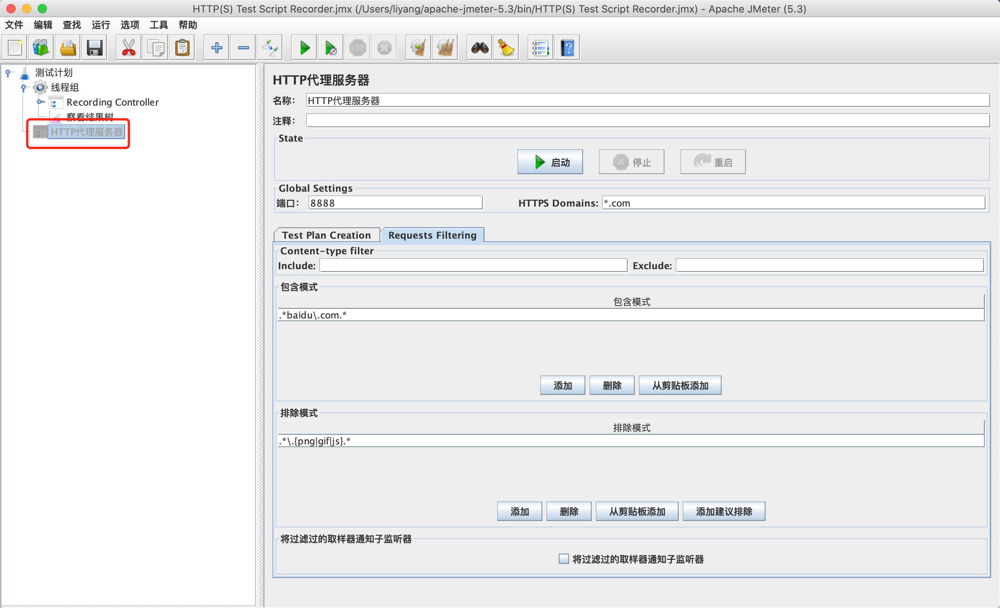
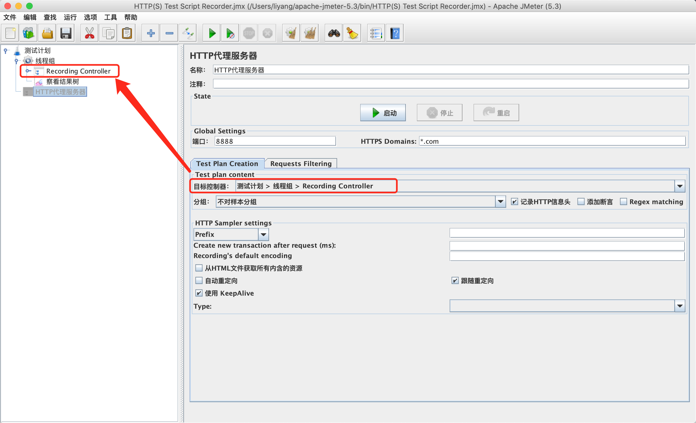
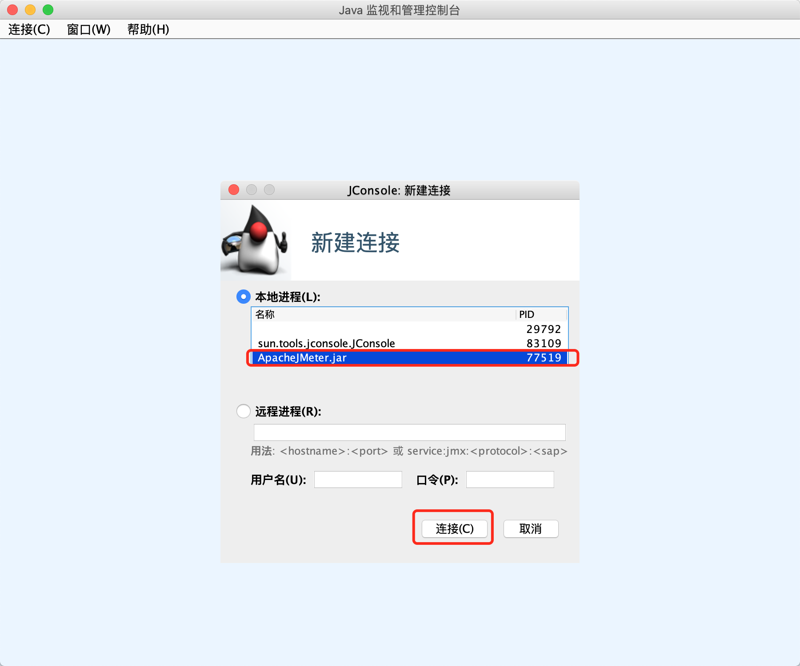
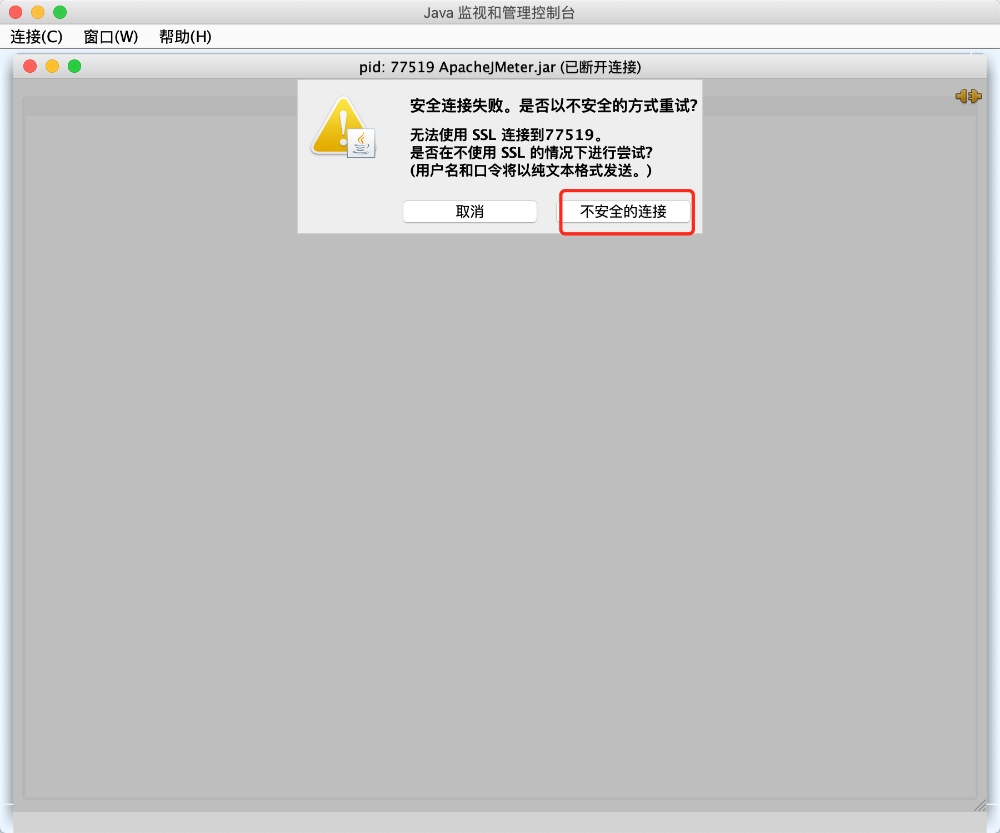
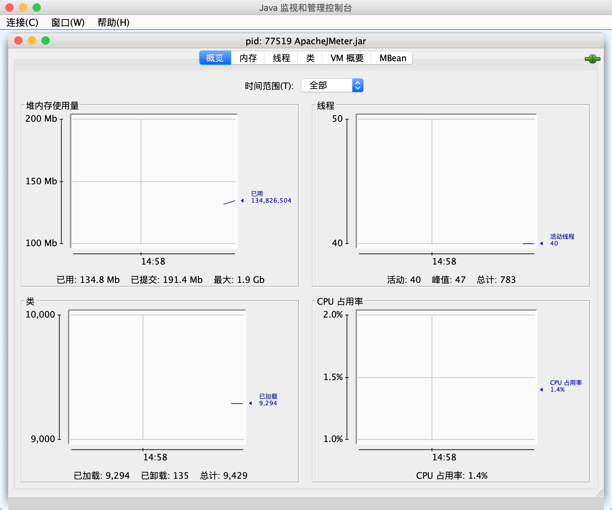
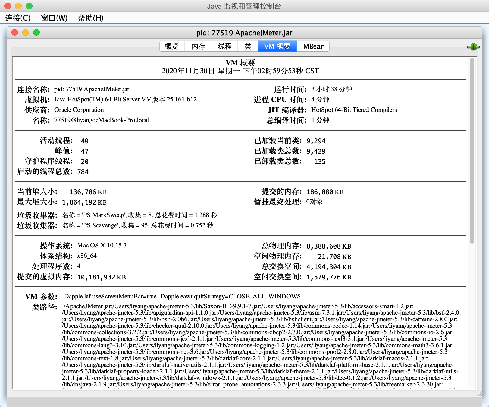
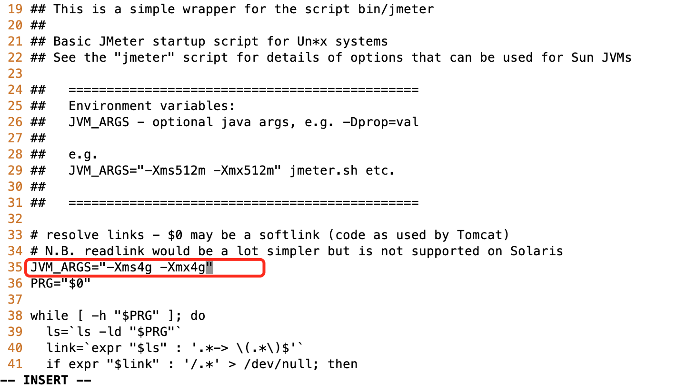
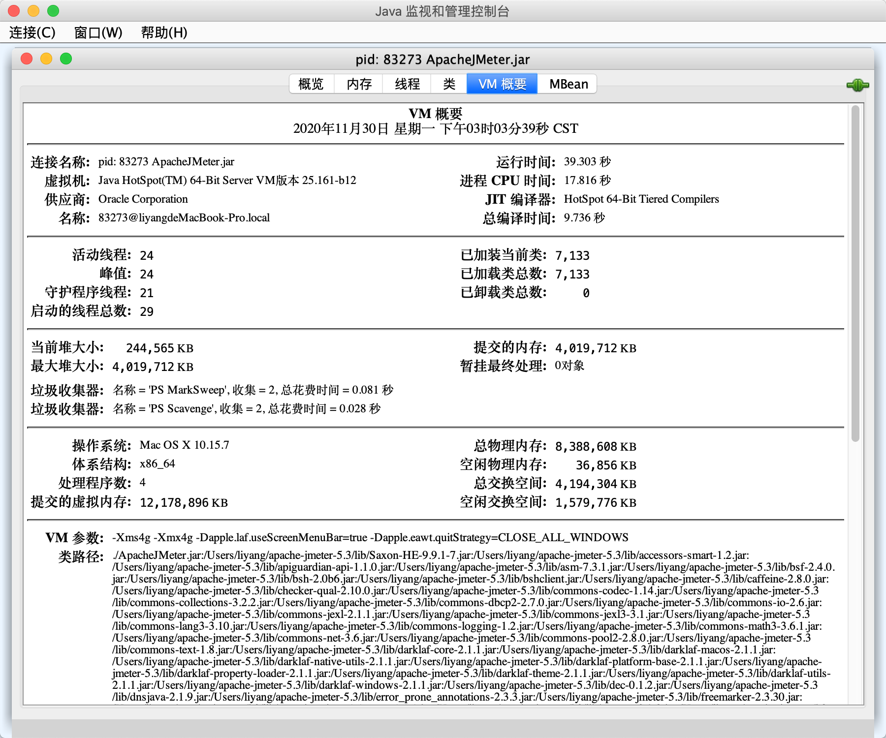

1.jmeter可以设置代理，录制

2.Jmeter监控情况

输入命令：`jconsole`

修改之后重启jmeter、jconsole

3.[用户定义的变量]里的变量是全局变量

4.jmeter plugin manage

在https://jmeter-plugins.org/install/Install/下载jra包

然后把jar包放到jmeter的lib/ext目录下，之后重启jmeter，就有这个插件了

什么时候需要事务控制元件？

一套的操作具有原子性，类似于数据库的【事务】的概念