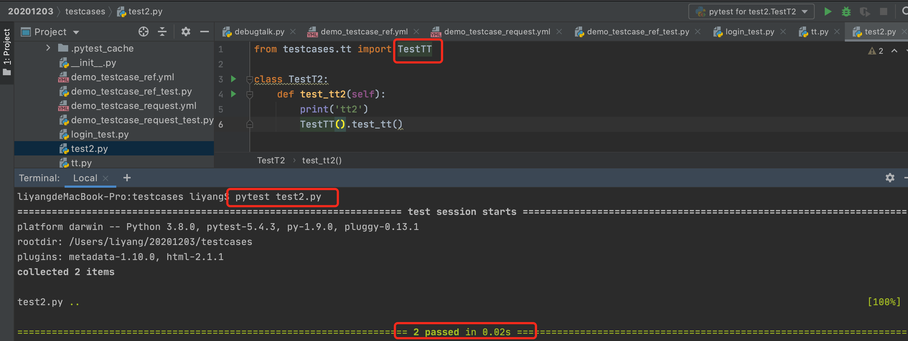
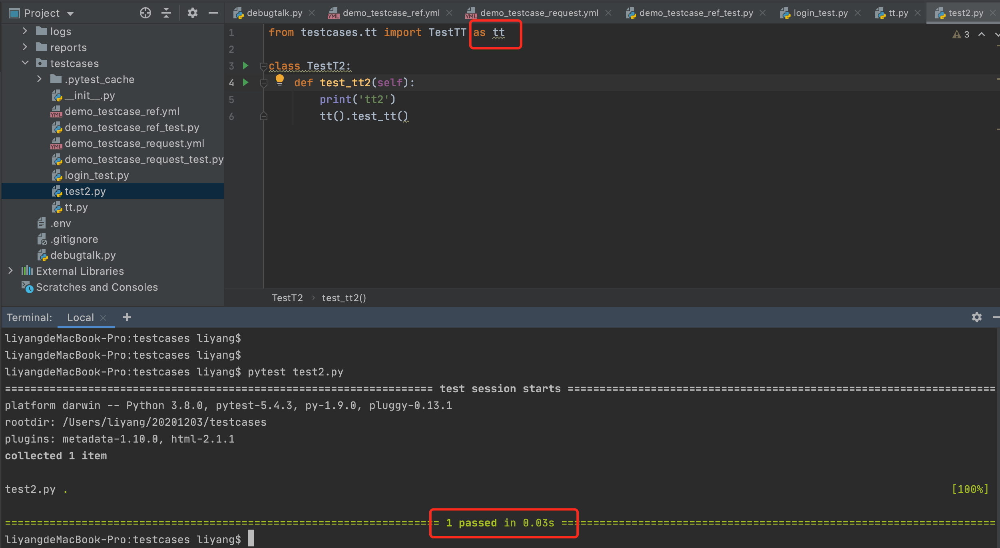

坑1:

test_b.py文件中导入test_A.pytest的TestA类，在test_b方法使用这个TestA类的一个test_a方法，如果在导入时不进行重名，【pytest test_b.py】这样运行时，会显示有2个test case，但是实际上只有test_b这个测试方法

重命名之后在执行就只显示一个测试方法啦～

因为pytest在运行时会扫所有带有Test的类，然后运行这些类里的测试方法

