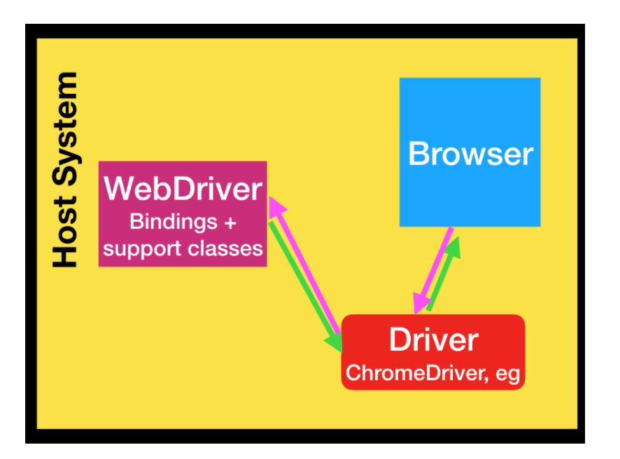
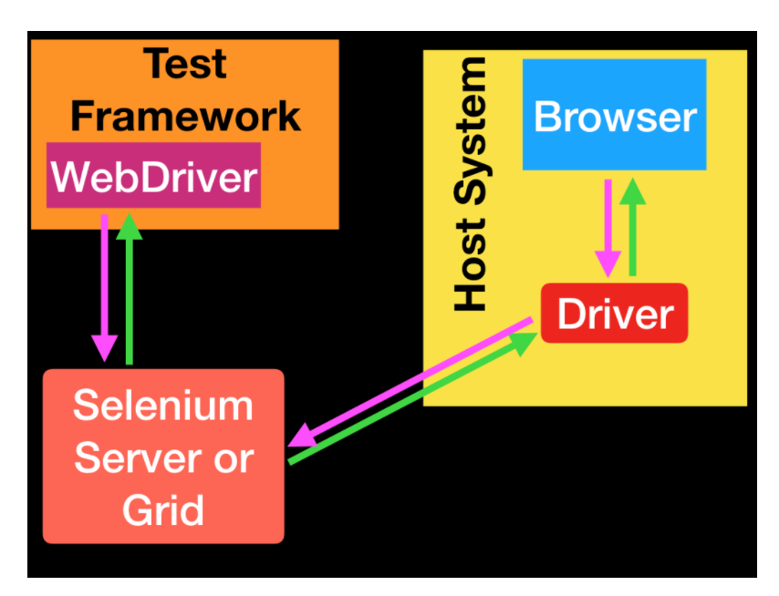
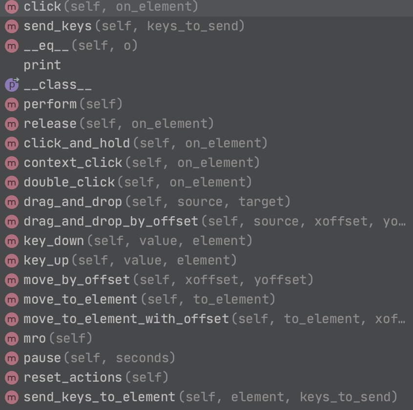
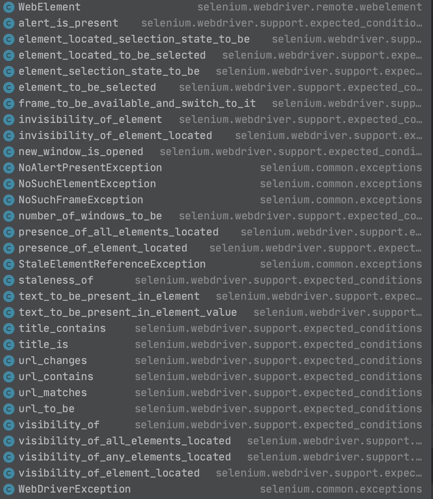
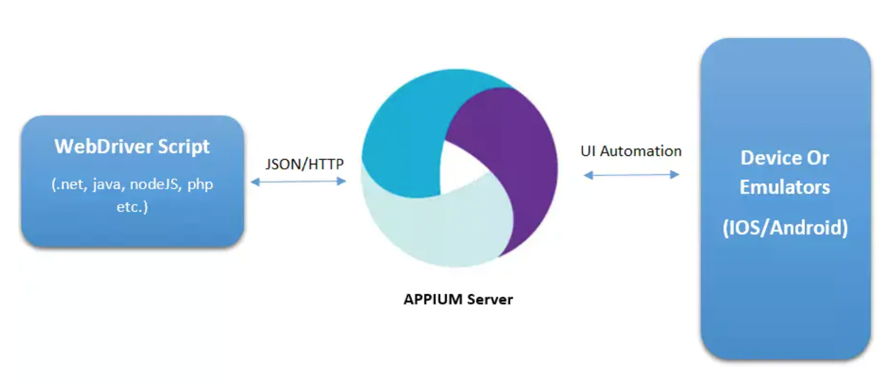
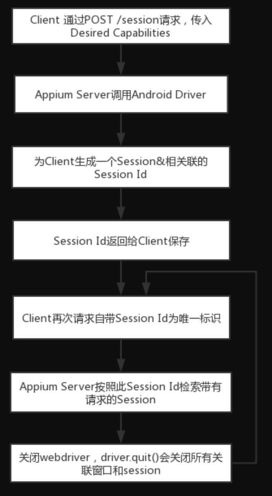
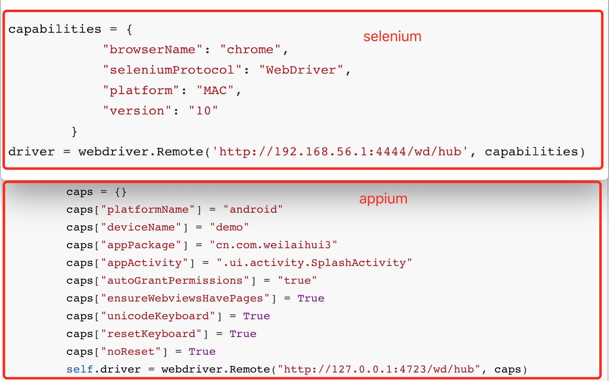
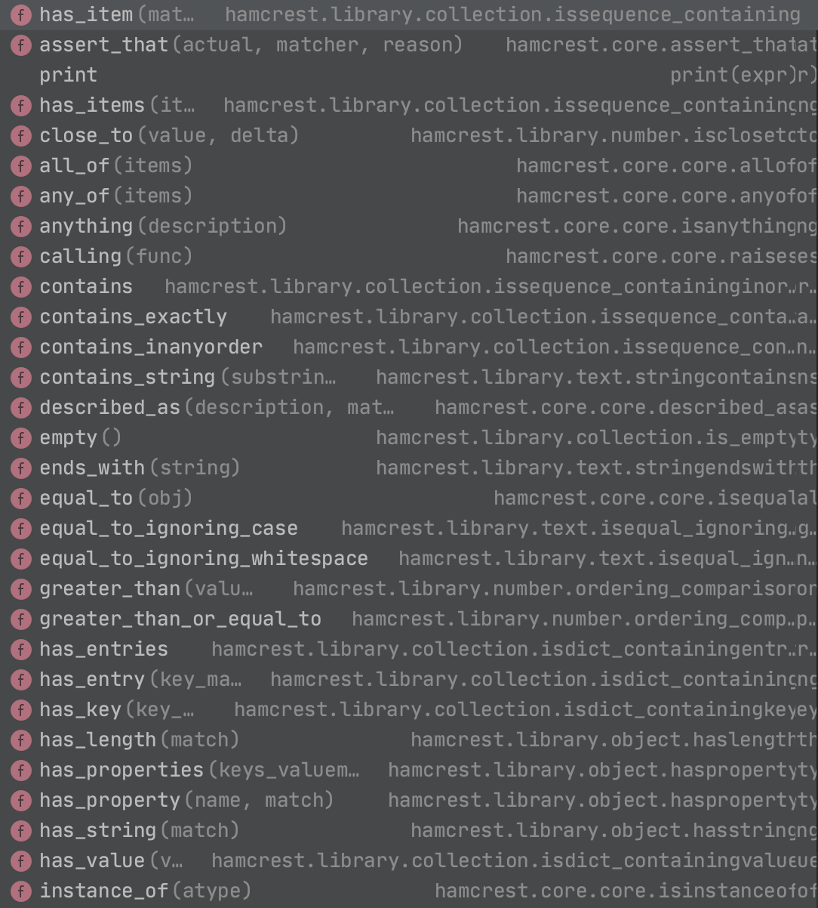
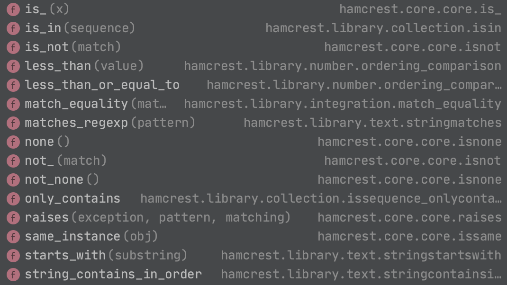

# 简介

​	selenium、appium 完成UI自动化的两驾马车，而appium其实是基于selenium+adb的，下面来详细说明一下这俩的原理、常用方法、一些面试题和工作中问题的解决。

​	selenium：3大组件、2种等待方式、8种定位方式、16个元素方法、3种switch_to控件、

## selenium

​	我们常说的selenium是指框架，就是java或者python中导入的那个包，但是其实它不只是框架部分，selenium是一个**web自动化测试工具**，它里面包含了几个工具：**webdriver、IDE、Grid**。其中我们最长用的是webdriver，毕竟代码里实例化一个Driver就是用的webdriver；Grid是用来做分布式，我们可以让case运行到不同的电脑、不同的系统上，既可以节省运行时间，也能做兼容性测试；IDE的话，用的很少，毕竟这个功能挺鸡肋的，很多好用的工具可以代替，比如我们强大的Chrome F12就行，Firefox也有代替工具，所以这个就不需要了。

### selenium原理：

其实，就下面这么一串：

代码——〉webdriver——〉浏览器driver——〉浏览器—返回结果—〉浏览器driver——〉webdriver——〉代码

这个写的不错可以参考：https://www.cnblogs.com/jiang-cheng/p/9914803.html

webdriver其实是一无所知的，它不知道怎么找到对象、怎么操作这个对象、结果是否符合预期····

它只做一件事：完成代码和浏览器driver的通信





webdriver api就是我们导入的包，我们使用这个webdriver编辑测试代码，webdriver会调用浏览器的driver，比如ChromeDriver，把来驱动浏览器

```python
driver = webdriver.Chrome()
driver.get('https://www.baidu.com')
ele = driver.find_element(By.XPATH,"//input[@id='kw']")
ele.send_keys('selenium')
time.sleep(5)
driver.quit()
```

上面4个步骤，根据上面的原理来解释一下。

（1）第一步：会先实例化webdriver对象，并且访问http://localhost:4444/wd/hub创建session，然后ChromeDriver带着sessionid去调用浏览器api新建了窗口

所以其实第一句代码实际上是以下2个过程的简写形式：

第一个过程为启动selenium server

`$ java -jar selenium-server-standalone-3.141.59.jar`

```python
capabilities = {
            "browserName": "chrome",
            "seleniumProtocol": "WebDriver",
            "platform": "MAC",
            "version": "10"
        }
driver = webdriver.Remote('http://192.168.56.1:4444/wd/hub', capabilities)
```


（2）第二步：driver这个对象就等同于sessionid，当执行第二步这行代码，实际是去请求ChromeDriver的get接口，浏览器driver收到请求后，去调浏览器API输入url访问，因为有了sessionid，所以ChromeDriver、浏览器知道是在那个窗口打开url。

（3）第三步：请求webdriver的find_element接口，参数xpath、value值，拿到elementid

（4）第四步：去请求webdriver的element send keys接口，webdriver调用浏览器API输入值。


通过日志可以更清楚的看到整个过程：初始化webdriver、初始化一个ChromeDriverService实例、启动ChromeDriver、创建连接的session、最终销毁session：

```bash
$ java -jar selenium-server-standalone-3.141.59.jar
20:22:11.487 INFO [GridLauncherV3.parse] - Selenium server version: 3.141.59, revision: e82be7d358
20:22:11.586 INFO [GridLauncherV3.lambda$buildLaunchers$3] - Launching a standalone Selenium Server on port 4444
2020-12-07 20:22:11.640:INFO::main: Logging initialized @402ms to org.seleniumhq.jetty9.util.log.StdErrLog
20:22:11.893 INFO [WebDriverServlet.<init>] - Initialising WebDriverServlet
20:22:11.998 INFO [SeleniumServer.boot] - Selenium Server is up and running on port 4444
20:22:36.081 INFO [ActiveSessionFactory.apply] - Capabilities are: {
  "browserName": "chrome",
  "platform": "MAC",
  "seleniumProtocol": "WebDriver",
  "version": "10"
}
20:22:36.083 INFO [ActiveSessionFactory.lambda$apply$11] - Matched factory org.openqa.selenium.grid.session.remote.ServicedSession$Factory (provider: org.openqa.selenium.chrome.ChromeDriverService)
Starting ChromeDriver 86.0.4240.22 (398b0743353ff36fb1b82468f63a3a93b4e2e89e-refs/branch-heads/4240@{#378}) on port 43534
Only local connections are allowed.
Please see https://chromedriver.chromium.org/security-considerations for suggestions on keeping ChromeDriver safe.
[1607343756.172][WARNING]: FromSockAddr failed on netmask
ChromeDriver was started successfully.
20:22:39.205 INFO [ProtocolHandshake.createSession] - Detected dialect: W3C
20:22:39.262 INFO [RemoteSession$Factory.lambda$performHandshake$0] - Started new session be34abcf3c046921f04e7c13f3d16e19 (org.openqa.selenium.chrome.ChromeDriverService)
20:22:45.603 INFO [ActiveSessions$1.onStop] - Removing session be34abcf3c046921f04e7c13f3d16e19 (org.openqa.selenium.chrome.ChromeDriverService)
```


### 元素8大定位方法：

id、xpath、css selector、link text、name、class name、tag name、partial_link_text

最简单唯一的肯定id，但是由于开发的不规范不写id属性，还有时候id是动态变化的，这时候xpath和css selector就很好用了

但如果我们看下面selenium的源码find_element方法会发现，其实id、name、class name、tag name的本质上都是css selector定位，所以其实很多人说什么id定位最好····这种说法也不是那么准确

```python
def find_element_by_id(self, id_):
    return self.find_element(by=By.ID, value=id_)

def find_element(self, by=By.ID, value=None):
    if self.w3c:
        if by == By.ID:
            by = By.CSS_SELECTOR
            value = '[id="%s"]' % value
        elif by == By.TAG_NAME:
            by = By.CSS_SELECTOR
        elif by == By.CLASS_NAME:
            by = By.CSS_SELECTOR
            value = ".%s" % value
        elif by == By.NAME:
            by = By.CSS_SELECTOR
            value = '[name="%s"]' % value
    return self.execute(Command.FIND_ELEMENT, {
        'using': by,
        'value': value})['value']
```

#### xpath和css定位

dom（document object model：文档对象模型）用于表示界面的控件层级，界面的结构化描述，常见的格式为html、xml，核心元素为节点和属性

xpath（xml path：xml路径语言）：用于xml的节点定位

css selector（css选择器）：用于根据元素的属性或属性值选择元素

xpath和css常用来定位不好一次性到位的元素，他们都是 ‘围魏救赵’、‘旁敲测试’ 式定位

举例：

xpath定位：

//* 任意元素、/ 孩子、//子子孙孙、.当前节点、..父亲节点

```python
driver.find_element_by_xpath("//div[@id='C']/../..")
driver.find_element_by_xpath("//div[@id='B']/div")
driver.find_element_by_xpath("//*[@text='登陆']")
```

css selector定位：

#id、. class、>孩子、空格 子子孙孙、:nth-child(n) 第几个孩子

```python
driver.find_element_by_css_selector('#id_value')
driver.find_element_by_css_selector('[id=id_value]')
driver.find_element_by_css_selector('.class_value')   
driver.find_element_by_css_selector("input[type='password']").send_keys('test')
driver.find_element_by_css_selector('div#B>div')
driver.find_element_by_css_selector('div#B div:nth-child(1)')
```

而对于css和xpath我们该如何选择呢？毕竟用例的好坏有一部分原因是和定位方式的选择有关的

先来科普一下页面的加载方式：页面是自上而下解析的，元素呈现顺序为：title-dom树-css（此时元素可见了）-js（此时元素才是可点击的）

**引申点**：我们有时候页面白屏时间过长，可以考虑优化js代码的位置，因为页面是自上而下解析的，所以如果js放在html代码的开始位置，那会占用大量的时间去下载js，导致白屏时间过长，所以可以把js放在html代码的末尾，先加载页面让用户能看到

css selector是依赖于js和页面css的加载的，也就是会等js加载完毕才会查找元素，毕竟css selector定位是通过css的样式来定位的，xpath的话是解析HTML和xml的dom结构，自上而下遍历来找到元素，所以css相对xpath来说寻找元素的速度比较快，但xpath也有优点，xpath即可以在html页面中也可以用在原生页面中，所以如果用例设计的好是可以做到web和app共用一套代码的，不过，这个需要考虑的很多，还需要依赖于web和app端的业务，所以还是尽量分开写，不过有些需要相对定位的xpath就挺适合的

所以：**没有最好的定位方式只有最适合的定位方式**


### 元素操作方法：

click、send_keys、clear、submit、is_enabled、is_displayed、is_selected、text、id、size、parent、location、tag_name、get_attribute、get_property、screenshot

从名称上也能猜出来这些方法都是干什么用的，这里就不赘述了

#### 特殊控件的操作方法

1.iframe：使用dirver.swith_to.frame('frame_id')切换iframe

2.alter：使用dirver.swith_to.alert()切换到alert中，然后accept确认、dismiss取消、send_keys输入、text获取内容

3.下拉框：这个要看下拉框的代码是怎么写的，可以使用ActionChains这个包里的鼠标的一些方法，或者是直接选择有时候也能选取到

4.上传文件：send_keys('文件路径')

5.时间控件：用js先去掉readonly属性，再send_keys

```python
driver.execute_script('arguments[0].removeAttribute(\"readonly\")', 要移除readonly的元素)
```

6.乱序密码键盘：先去掉readonly属性，再send_keys

如果一些普通方法没有效果，可以祭出大招：**driver.execute_script('任意js代码')**

#### 处理cookie的方法

方法1：把登陆case设置为setup module级别，使用pytest的fixture功能

方法2：先登陆driver.get_cookies()记录好cookie，然后再初始化dirver时候带上这个cookie：driver.add_cookies(cookie)

方法3：先登陆，然后复用打开的这个浏览器

#### 特别的方法

ActionChains库里有一些鼠标的动作，不具体举例了图片奉上

ps：appium有个类似的，叫TouchAction

分享一个记忆方法：一般web页面都是鼠标的动作链，所以叫ActionChain，而App端都是触摸式的，就是TouchAciton



excepted_conditions：和显示等待配合使用




## appium

### appium原理





可以参考这篇，写的不错：https://www.cnblogs.com/sophia194910/p/7515165.html

appium底层是selenium，所以基本和selenium类似：

代码〈——〉appium server〈——〉Bootstrap〈——〉uiautomator｜uiautomation〈——〉app

appium server同样和selenium server一样，什么都不处理，就是做一个转发而已，但这个转发也是由不同的模块来支撑的， 比如adb shell、ChromeDriver

同样，appium server如何判断发送到哪台设备呢——session_id。是不是感觉连起来了？还有更妙的，不同的设备，不同的终端都是靠session_id区分，所有appium当然也包含selenium天然就支持分布式，这样selenium Grid简直是顺其自然啊。

上一段代码具体看看：

```python
import time
from appium import webdriver
from selenium.webdriver.support.wait import WebDriverWait
class TestWeilaiAndroid():
    def test_nioapp(self):
        caps = {}
        caps["platformName"] = "android"
        caps["deviceName"] = "demo"
        caps["appPackage"] = "cn.com.weilaihui3"
        caps["appActivity"] = ".ui.activity.SplashActivity"
        caps["autoGrantPermissions"] = "true"
        caps["ensureWebviewsHavePages"] = True
        caps["unicodeKeyboard"] = True
        caps["resetKeyboard"] = True
        caps["noReset"] = True
        self.driver = webdriver.Remote("http://127.0.0.1:4723/wd/hub", caps)
        # 一般第一次比较满，所以放在setup_class比较好
        # 隐式等待implicitly
        self.driver.implicitly_wait(10)
        el3 = self.driver.find_element_by_xpath("//*[@resource-id='custom_tab_tv' and @text='爱车']")
        el3.click()
```

是不是莫名的熟悉，来上一张对比图：

是不是90%的类似？再次证明底层是一样的selenium

caps里带的就是一些配置信息，告诉server端本次运行的上下文，是跑在浏览器上，还是跑在androd上，还是跑在ios上，跑在哪个app上，哪个activity上



日志：

下面是截取了appium server的开头部分日志，可以明显的看到session_id的获取过程：

调用一个post接口http://127.0.0.1:8200/wd/hub/session，传输caps参数，接口返回了sessionId和环境设备的确认信息，然后后面的接口请求都带着这个sessionId

**引申点**：既然是通过http请求来调用appium server的，那岂不是只要能发http请求就行？这就是appium支持多语言的原因，只要这个语言，不论是java、python、go甚至是shell的curl命令，能发起http请求，那就能兼容。

```bash
[debug] [WD Proxy] Matched '/status' to command name 'getStatus'
[debug] [WD Proxy] Proxying [GET /status] to [GET http://127.0.0.1:8200/wd/hub/status] with no body
[debug] [WD Proxy] Got response with status 200: {"sessionId":"None","value":{"message":"UiAutomator2 Server is ready to accept commands","ready":true}}
[debug] [UiAutomator2] The initialization of the instrumentation process took 4131ms
[debug] [WD Proxy] Matched '/session' to command name 'createSession'
[debug] [WD Proxy] Proxying [POST /session] to [POST http://127.0.0.1:8200/wd/hub/session] with body: {"capabilities":{"firstMatch":[{"platform":"LINUX","webStorageEnabled":false,"takesScreenshot":true,"javascriptEnabled":true,"databaseEnabled":false,"networkConnectionEnabled":true,"locationContextEnabled":false,"warnings":{},"desired":{"platformName":"android","deviceName":"demo","appPackage":"cn.com.weilaihui3","appActivity":".ui.activity.SplashActivity","autoGrantPermissions":true,"ensureWebviewsHavePages":true,"unicodeKeyboard":true,"resetKeyboard":true,"noReset":true},"platformName":"android","deviceName":"emulator-5554","appPackage":"cn.com.weilaihui3","appActivity":".ui.activity.SplashActivity","autoGrantPermissions":true,"ensureWebviewsHavePages":true,"unicodeKeyboard":true,"resetKeyboard":true,"noReset":true,"deviceUDID":"emulator-5554"}],"alwaysMatch":{}}}
[debug] [WD Proxy] Got response with status 200: {"sessionId":"92b50fa1-8269-4c31-987b-89171c9dae4b","value":{"capabilities":{"firstMatch":[{"platform":"LINUX","webStorageEnabled":false,"takesScreenshot":true,"javascriptEnabled":true,"databaseEnabled":false,"networkConnectionEnabled":true,"locationContextEnabled":false,"warnings":{},"desired":{"platformName":"android","deviceName":"demo","appPackage":"cn.com.weilaihui3","appActivity":".ui.activity.SplashActivity","autoGrantPermissions":true,"ensureWebviewsHavePages":true,"unicodeKeyboard":true,"resetKeyboard":true,"noReset":true},"platformName":"android","deviceName":"emulator-5554","appPackage":"cn.com.weilaihui3","appActivity":".ui.activity.SplashActivity","autoGrantPermissions":true,"ensureWebviewsHavePages":true,"unicodeKeyboard":true,"resetKeyboard":true,"noReset":true,"deviceUDID":"emulator-5554"}],"alwaysMatch":{}},"sessionId":"92b50fa1-8269-4c31-987b-89171c9dae4b"}}
[WD Proxy] Determined the downstream protocol as 'W3C'
[debug] [WD Proxy] Proxying [GET /appium/device/info] to [GET http://127.0.0.1:8200/wd/hub/session/92b50fa1-8269-4c31-987b-89171c9dae4b/appium/device/info] with no body
[debug] [WD Proxy] Got response with status 200: {"sessionId":"92b50fa1-8269-4c31-987b-89171c9dae4b","value":{"androidId":"1bafb5f131f164a3","apiVersion":"23","bluetooth":{"state":"OFF"},"brand":"Android","carrierName":"","displayDensity":416,"locale":"zh_CN","manufacturer":"Netease","model":"MuMu","networks":[{"capabilities":{"SSID":null,"linkDownBandwidthKbps":1048576,"linkUpstreamBandwidthKbps":1048576,"networkCapabilities":"NET_CAPABILITY_NOT_RESTRICTED,NET_CAPABILITY_NOT_VPN,NET_CAPABILITY_INTERNET,NET_CAPABILITY_TRUSTED,NET_CAPABILITY_VALIDATED","signalStrength":-55,"transportTypes":"TRANSPORT_WIFI"},"detailedState":"CONNECTED","extraInfo":"\"fqaDnpAtAe\"","isAvailable":true,"isConnected":true,"isFailover":false,"isRoaming":false,"state":"CONNECTED","subtype":0,"subtypeName":"","type":1,"typeName":"WIFI"}],"platformVersion":"6.0.1","realDisplaySize":"1872x1170","timeZone":"Asia/Shanghai"}}
```

### 常用元素定位方法

#### ios和android一致的定位：

对于webview来说和selenium一样，而且ios和android也一样，所以这里就不赘述了，可以看selenium部分，接下来重点说一下ios和android在**原生**app上的定位：

ios和android通用的：**xpath、id、accessibility_id**，但是！！！要注意，他们的id和accessibility_id对应的原生控件的属性名不一样！！！！

对于android来说，resourceid属性对应的定位方式是id，对于ios来说name属性对应的定位方式是id

对于android来说，content_desc属性对于的定位方式是accessbility_id，而对于ios来说accessibility_id属性对于的定位方式是accessibility_id

xpath的话，ios和android定位方式一样了，都是通过xml结构解析定位

对于这3种定位方式，推荐的顺序是：id>accessibility_id>xpath

这里说明一下原生控件是没有css selector定位的，这也很好理解，因为原生不是html和css写的

#### ios和android不一致的定位：

Android：android_uiautomator、name（text属性）、class_name（class属性，一般不用）

ios：ios_predicate、class_name（type属性，一般不用）

android_uiautomator和ios_predicate这俩类似，都是调用各自原生的方法，定位元素都很快，但是缺点是IDE没法校验写的到底对不对

#### 特殊控件的操作方法

1.webview

对于app来说，只有一个webview我认为是特殊控件，其他的都直接定位就行，对于webview来说困难的是如何获取元素定位，只要能知道元素定位，那直接使用selenium那一套就行了，但是难点就在如何定位上，一下几点供参考：

1）最常用的一种方法：让开发打开webview开关，这样就能直接在+UIAutomator之类的工具里定位了

2）直接在chrome中访问webview对应的url，使用chrome 开发者工具定位即可

那如何获取这个url，一般自己公司的产品的话直接问开发就行，或者一般的webview都有分享的功能，分享一下看看url，最后实在不行就用adb logcat | grep抓一下

3）使用chrome 的inspect工具，但是这个工具得翻墙，还得手机的浏览器内核是chrome，如果能翻的话，那还是挺好用的，和Chrome的F12效果一样，只不过不需要抓url，只需要手机打开webview页面，adb devices能查到设备，直接在inspect中就可以看了

4）使用android6.0版本的模拟器+UIAutomator之类的工具，这是因为android有bug才能这样，其他的android版本是不行的

首先要：caps中增加配置

```python
caps['browserName']='Chrome'
caps['chromedriverExecutable']='本机chrome driver存放路径'
```

ps：这里的chrome driver的版本要和手机设备的chrome版本对应，那如何获取手机的Crome版本呢？

```bash
adb shell dump com.android.webview | grep version
```

然后要：切换到webview

```python
# 获取页面所有的contexts对象，和selenium的句柄一样，返回一个list
contexts = driver.contexts
# 切换到webview
driver.switch_to.context(contexts[1])
# 也可以这样切
# driver.switch_to.context('WEBVIEW_com.tencent.mm:tools')
# 切回native
driver.switch_to.context(contexts[0])
# 这样也是可以的切回原生页面
# driver.switch_to.context("NATIVE_APP") 
```

ps：如何可以快速的就先判断出是否是webview而不是定位不到之后查问题才知道呢？

1）页面加载时顶部都有一个加载进度条（一定）

2）断网以后页面加载不出来（一定）

3）下拉刷新显示了网页提供方的名字（一定）

4）下拉动作以后页面会刷新（可能是）

5）顶部左侧有关闭按钮（可能）

6）页面布局代码显示android.webkit.webview（这个不必说，肯定是了）

2.toast，这种toast都是系统发出的，且页面一般只有一个toast（这个要和弹框分开，一些什么升级、定位、权限的那种弹框不是toast）

```python
driver.find_element(By.XPATH,'//*[@class="android.widget.Toast"]')
driver.find_element(By.XPATH,'//*[contains(@text,"点赞成功")]')
```

### 元素操作方法

click、send_keys、clear、submit、is_enabled、is_displayed、is_selected、text、id、size、parent、location、tag_name、get_attribute、get_property、screenshot

ps：和selenium完全一样

### 特别的方法

TouchAction对象：wait（等待）、press（按住）、move_to（移动到）、release（释放手指）、perform（执行前面的一串动作）、long_press（长按）、tap（单击）

```python
action = TouchAction(driver)
# 页面上划
action.press(x=710, y=1800).wait(100).move_to(x=100, y=1800).release().perform()
```

引申点：上面这一串的【页面上划】的动作就是我们做框架是要封装的，这一串代码太不优雅了

appium还可以模拟一些手机的功能，比如来电、短信、切换网络、录屏等（反正底层原理是adb）

ps:有些模拟器是不支持来电和短信的，执行代码会报错

```python
# 模拟来电
driver.make_gsm_call('15812341234', GsmCallActions.CALL)
# 模拟短信
driver.send_sms('15812341234', 'msg info')
# 切换为飞行模式，具体什么模式对应什么数字可以看源码
driver.set_network_connection(1)
# 具体设置什么速度，看【NetSpeed】源码
driver.set_network_speed('gsm')
# 截图
driver.get_screenshot_as_file('screen1.png')
# 开始录屏.android 8.0以上才支持
driver.start_recording_screen()
ele.click()
# 结束录屏
driver.stop_recording_screen()
```

## 断言

1.assert：这个简直太熟悉了，就简单一个例子回忆一下

```python
assert ele.text.__contains__('成功')
```

2.Hamcrest：需要安装PyHamcrest

hamcrest算是帮我们封装了，这样就不需要我们在框架里封装了，hamcrest里有很多我们可能用assert需要稍微写的长一点的语句，比如any_of、all_of，这种，用assert也能写，就是比较妈蛋，用这个hamcrest一句话就行，hamcrest比较特别的一个方法就是：close_to，这个方法可以设置

```python
# close_to：判断预期值（下面例子中的2.1）是否在给定值（下面例子中的2）的偏移量（下面例子中的0.09和0.11）范围内
# 下面这句assert报错
assert_that(2.1, close_to(2,0.09))
# 下面这句assert成功
assert_that(2.1, close_to(2,0.11))
```

具体hamcrest的方法太多了，截图看看得了，用到时候选






## 元素定位不到原因分析

做UI自动化，很多人都被case的不稳定拖垮、劝退，归根到底UI测试不稳定的原因其实就一个：没找到元素

这个问题的可能原因就有很多，也是很多人被劝退的原因，但是其实仔细分析一下，外加一下代码的封装，这些问题都是可以避免的，下面就对几种不同的原因分析并推荐一下相应的解决办法：

1.网络原因

这个是最好解决的：合理使用隐式等待、显示等待、强制等待

那怎么个合理使用呢？

可以先大概统计一下你们的页面的平均打开时间是多长时间，根据这个时间设置全局隐式等待时间，然后在一些动态加载资源的页面、或者是什么前提条件的逻辑的时候加显示等待（只有达到什么条件才继续执行），这样2个等待配合一般就能解决了网络原因了，如果还是不行，那就加强制等待，但是这种情况也不多，加一两个对整个流程的速度也影响不大，这里要提醒：我们是先要保证case 的稳定，然后在稳定的基础上在考虑速度

```python
# 隐式等待
driver.implicitly_wait(5)
# 显示等待
WebDriverWait(driver,10).until(expected_conditions.element_to_be_clickable(ele))
# 强制等待
time.sleep(5)
```

2.就是单纯的没有定位到：

这个可能要看看当时的报错信息，看看为啥有时候能定位到有时候定位不到

看一下是因为元素的属性会变、还是说页面的动态加载的（一开始加载出来和最后呈现效果的位置不是同一个位置）、或者是元素在iframe里、或者是新打开的页面、或者是在一个alert窗口中。如果是属性会变的话，那就换个定位方式，换成相对定位；如果是动态加载的原因可以加入等待机制；如果是iframe或者窗口的原因，那就使用driver.swith_to切换进去后在进行操作,窗口的话使用driver.window_handles获取句柄

3.弹窗（主要体现在app端自动化上）

可以写一个黑名单方法（里面定义了很多弹框元素，比如包含内容为【同意】的空间，以及对应的操作，比如点击【同意】，这样就把这类的弹框取消掉了，然后定一个最多扫描的次数，比如黑名单扫描了3次以后就退出，不论有没有操作黑名单空间，超过3次就退出），try-except一下，定位不到元素的时候就调用黑名单方法，通过黑名单方法操作弹框空间，然后要合理设置每次case的setup方法，app启动时候的模式需要设置好，不需要每次case都要重装、重启、清除缓存这样子

**引申点**：下面列几个相关的caps设置（能看出来就是skip各种）：skipDevicesInitialization、skipServerInstallation、skipUnlock、skipLogcatCapture、dontStopAPPOnReset

4.分布式运行时由于case之间相互影响导致的：

比如A case执行完之后，页面的信息发生了变化，B case就会出错，这是自动化方案设计的问题，梳理一下case的依赖关系，尽量解耦合


## 分布式部署运行

使用selenium Grid实现，


### selenium Grid：

步骤1:启动hub节点：

```bash
$ java -jar selenium-server-standalone-3.141.59.jar -role hub -port 4444
```

步骤2：启动node节点：

```bash
$ java -jar selenium-server-standalone-141.59.jar -role node -port 4445 -nodeConfig node.json
```

步骤3:编辑代码：

```python
import time
import pytest
from selenium import webdriver
 
 
class TestGrid:
    def test_hub(self):
        capabilities={
                "browserName": "chrome",
                "seleniumProtocol": "WebDriver",
                "platform": "MAC",
                "version": "10"
            }
        driver = webdriver.Remote('http://192.168.56.1:4444/wd/hub',capabilities)
        driver.get('https://wwww.baidu.com')
        time.sleep(5)
        driver.quit()
```

运行完成后打印的日志：

hub打印的日志：

```bash
10:55:50.342 INFO [RequestHandler.process] - Got a request to create a new session: Capabilities {browserName: chrome, platform: MAC, seleniumProtocol: WebDriver, version: 10}``10:55:50.343 INFO [TestSlot.getNewSession] - Trying to create a new session on ``test` `slot {server:CONFIG_UUID=d4379450-1f66-40da-a32e-c88d017ea32d, seleniumProtocol=WebDriver, browserName=chrome, maxInstances=5, platformName=MAC, version=10, platform=MAC}
```

node打印的日志

```bash
10:55:50.355 INFO [ActiveSessionFactory.apply] - Capabilities are: {
  "browserName": "chrome",
  "goog:chromeOptions": {
  },
  "platform": "MAC",
  "seleniumProtocol": "WebDriver",
  "version": "10"
}
10:55:50.355 INFO [ActiveSessionFactory.lambda$apply$11] - Matched factory org.openqa.selenium.grid.session.remote.ServicedSession$Factory (provider: org.openqa.selenium.chrome.ChromeDriverService)
Starting ChromeDriver 86.0.4240.22 (398b0743353ff36fb1b82468f63a3a93b4e2e89e-refs/branch-heads/4240@{#378}) on port 9813
Only local connections are allowed.
Please see https://chromedriver.chromium.org/security-considerations for suggestions on keeping ChromeDriver safe.
[1607223350.408][WARNING]: FromSockAddr failed on netmask
ChromeDriver was started successfully.
10:55:52.126 INFO [ProtocolHandshake.createSession] - Detected dialect: W3C
10:55:52.128 INFO [RemoteSession$Factory.lambda$performHandshake$0] - Started new session 6f9a43d0829ccb56e37540afca296450 (org.openqa.selenium.chrome.ChromeDriverService)
10:55:58.383 INFO [ActiveSessions$1.onStop] - Removing session 6f9a43d0829ccb56e37540afca296450 (org.openqa.selenium.chrome.ChromeDriverService)
```

node.json文件：

```bash
{
  "capabilities":
  [
    {
      "browserName": "chrome",
      "maxInstances": 5,
      "seleniumProtocol": "WebDriver",
      "platform": "MAC",
      "version": "10"
    }
  ],
  "proxy": "org.openqa.grid.selenium.proxy.DefaultRemoteProxy",
  "maxSession": 5,
  "port": -1,
  "register": true,
  "registerCycle": 5000,
  "hub": "http://localhost:4444",
  "nodeStatusCheckTimeout": 5000,
  "nodePolling": 5000,
  "role": "node",
  "unregisterIfStillDownAfter": 60000,
  "downPollingLimit": 2,
  "debug": false,
  "servlets" : [],
  "withoutServlets": [],
  "custom": {}
}
```

### docker+selenium Grid

第一步：启动selenium hub容器：

```bash
$ docker run --name=hub -p 5555:4444 -e GRID_TIMEOUT=30000 -e GRID_THROW_ON_CAPABILITY_NOT_PRESENT=true -e GRID_NEW_SESSION_WAIT_TIMEOUT=5000 -e GRID_BROWSER_TIMEOUT=15000 -e GRID_CLEAN_UP_CYCLE=30000 -d selenium/hub
```

第二步：启动node容器：

ps：这里启动【node-chrome-debug】镜像是为了更好的调试，这里可以下载VNC View来看运行结果

--link选项是用来和hub容器进行关联，但是这个选项只能是hub和node部署于同一台机器才行

```bash
$ docker run --name=chrome -p 5900:5900 -e NODE_MAX_INSTANCES=5 -e NODE_MAX_SESSION=5 -e NODE_REGISTER_CYCLE=5000 --link hub -d selenium/node-chrome-debug
```

第三步：执行代码：

```python
import os
import time
import pytest
from selenium import webdriver
 
 
class TestHubDocker:
    def test_hub(self):
        capabilities={
                "browserName": "chrome",
                # 这里注意，不要写下面这几个配置，不然就会报错，盲猜是因为没有node.json文件
                # "seleniumProtocol": "WebDriver",
                # "platform": "MAC",
                # "version": "10"
            }
        driver = webdriver.Remote('http://127.0.0.1:5555/wd/hub',capabilities)
        driver.get('https://wwww.baidu.com')
        time.sleep(5)
        driver.quit()
```

### appium Grid　

如果是要把Appium服务注册到selenium Grid的话，和selenium的不一样启动脚本、node.json配置都不一样

多node配置时【configuration】的【url、port】这俩参数里涉及到端口的改成和已经启动的node节点的配置不一样的（selenium node不需要改是因为selenium node启动命令中已经指定了端口号）

第一步，还是启动hub节点：

```bash
$ java -jar selenium-server-standalone-3.141.59.jar -role hub
```

第二步：配置node.json：

官方参考连接为：https://appium.io/docs/cn/advanced-concepts/grid/

复制官方的注意，它在【"hubHost":】这一行最后少了一个逗号

appium的node.json格式如下：

```bash
{
  "capabilities":
      [
        {
          "browserName": "ANDROID",
          "version":"6.0",
          "maxInstances": 1,
          "platform":"ANDROID",
          'deviceName':'node_devices'
        }
      ],
  "configuration":
  {
    "cleanUpCycle":2000,
    "timeout":30000,
    "proxy": "org.openqa.grid.selenium.proxy.DefaultRemoteProxy",
    "url":"http://localhost:4723/wd/hub",
    "host": "localhost",
    "port": 4723,
    "maxSession": 1,
    "register": true,
    "registerCycle": 5000,
    "hubPort": 4444,
    "hubHost": "192.168.91.78",
    "hubProtocol": "http"
  }
}
```

启动节点命令：

```bash
$ appium --nodeconfig node_app.json
```

 如何分发到不同的设备呢？把uid使用shell命令读出来，然后传入到测试脚本中

第三步：编辑代码

```python
class TestAppiumToGrid:
    driver = None

    def setup(self):
        caps={}
        caps['platform'] = 'android'
        caps['platfromVersion'] = '6.0'
        caps['deviceName'] = os.popen('bash run.sh').read()
        caps['appPackage'] = 'com.xueqiu.android'
        caps['appActivity'] = '.main.view.MainActivity'
        self.driver = webdriver.Remote("http://192.168.56.1:4444/wd/hub",caps)
        self.driver.implicitly_wait(10)
```

run.sh

```bash
for i in `adb devices | awk /device$/'{print $1}'`
do
  echo ${i}
done
```


## 面试题：

https://www.cnblogs.com/www-qcdwx-com/p/11520878.html

### hidden或者是display ＝ none的元素如何定位到？

定位是可以定位到的，可以find到，可以打印出元素的属性，只是不能操作，比如send_keys、click会报错【ElementNotInteractableException】，如果时要操作的话，使用js直接操作就行：

```python
driver.execute_script("document.getElementById('baidu').click()")
```

### 说一下遇到的定位问题以及你是怎么解决的？

特别的印象较为深刻的有2个：

1.页面已经切换到iframe但是还是没有定位到，打印了context才看到原来开发写的不规范开了2层iframe，这个先是提bug给开发规范代码，然后就是重新选择iframe进入后定位

2.appium 1.4的bug，会有webview点击一次再操作就找不到元素的问题，这个1.5以上已经解决，1.4的话需哟啊加这一句【 caps["recreateChromeDriverSessions"]="true"】

3.页面有个时间倒计时的插件，这个插件让页面一直是动态加载中，，appium server会认为页面一直没有加载完，会一直等到超时然后报找不到元素，这个的解决办法是设置超时等待时间【caps["waiForIdleTimeOut"]=0】

# 提高篇

### PO模式6大原则：

- 对外提供的方法代表了页面提供的服务

- 尽量不要显示页面内部细节

- 方法返回其他页面的对象

- 封装PO的过程不加断言

- 同样行为不同结果需要建模为不同的方法

- 不需要建模全部的页面

  不是所有的元素定位都要抽取出来的，比如PO层里的相关服务的操作元素的定位，直接写在Page层定义为私有变量就行，反正也不多，而且只在本page里用到，万一后期页面改动，那也只改动一个地方而已

### 如何搭建UI自动化框架

本质就是封装：封装定位、封装动作、封装校验

长动作进行封装：比如下滑页面到某个元素进行点击，可以封装成一个动作

封装driver，不在case中暴露driver细节

封装find方法：不同的定位方式、find不到时黑名单处理

错误截图

集成allre报告

弹框处理：装饰器

如何选择本次运行哪些case

​	1）pytest.ini里选择运行的py文件、class、function

​	2）conftest.py+mark

为什么封装？

​	1）同样的代码比如：self.driver.find_element_by_id这样类似的出现3次以上就可以考虑封装了，

​	2）

### 如何提升UI自动化的执行速度？

1.pytest-xdist

2.selenium Grid+集群

3.优化代码

​	1）优化caps启动项

​	2）优化各种等待时间

还是有限用1、2这俩方法，调case能优化的空间是有限的