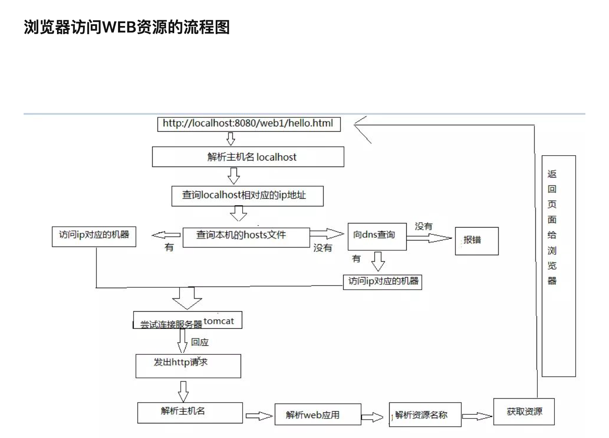

## 浏览器中输入一个url按下回车键到页面最终展示出来效果，中间都经历了什么过程？

## 出现一个bug如何做一个初步的定位和排查

1、抓http接口分析

2、如果是后端问题，可以看看这个功能属于哪个服务提供的，直接去看这个服务日志报错

3、后端问题，如果服务没有报错，可以看看是不是数据链路有问题，排查数据存储和链路问题

# http和https

在软件开发中，测试环境和生产环境使用不同的协议（HTTP 与 HTTPS）是出于多种考虑：

1. **成本**：HTTPS 需要 SSL/TLS 证书，对于非自签名证书，这通常需要购买。测试环境可能有很多个，为每个环境购买证书会增加成本。而HTTP不需要证书，因此更加经济。

2. **配置复杂性**：配置HTTPS涉及到证书的生成、安装和维护，这增加了测试环境的配置复杂性。测试环境通常需要快速搭建和频繁更改，使用HTTP可以简化这个过程。

3. **性能**：HTTPS 通过加密和解密数据增加了CPU负载，这可能会影响性能测试的结果。测试环境主要用于功能测试和开发，而不是性能测试，因此通常不需要HTTPS。

4. **安全性要求**：生产环境处理的是真实数据，包括用户信息、支付信息等敏感数据，因此需要 HTTPS 来保证数据传输的安全性。而测试环境通常不处理敏感数据，因此对安全性的要求较低。

5. **性能测试**：在某些情况下，测试环境可能会用于性能测试，但不涉及加密的数据可以提供更清晰、无干扰的性能指标，帮助开发者更好地理解应用在没有额外负载下的表现。

6. **法律和合规性**：一些法规和合规要求可能强制生产环境使用HTTPS来保护用户数据，而测试环境不受这些要求的约束。

7. **开发便利性**：开发者在开发过程中可能需要频繁地访问和调试后端服务，使用HTTP可以更方便地查看数据和调试。

8. **证书管理**：生产环境的证书需要定期更新和妥善管理，而在测试环境中管理这些证书需要额外的工作量和注意安全问题。

9. **安全性测试**：尽管测试环境通常不使用HTTPS，但开发者仍可能在测试环境中设置HTTPS，以测试应用的安全性和兼容性。

尽管测试环境可能不使用HTTPS，但一些团队可能会选择在测试环境使用自签名证书来模拟生产环境的安全性场景，或者进行端到端的加密测试。这完全取决于项目的具体需求和安全策略。